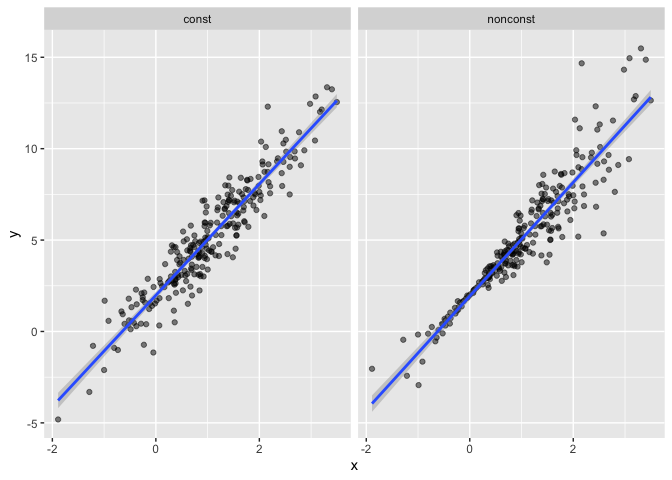
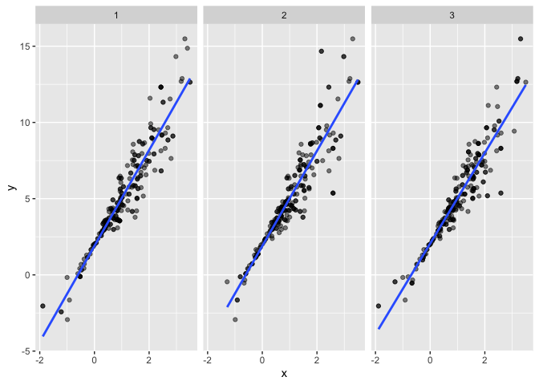
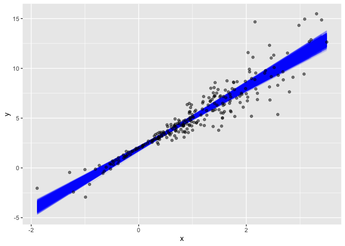
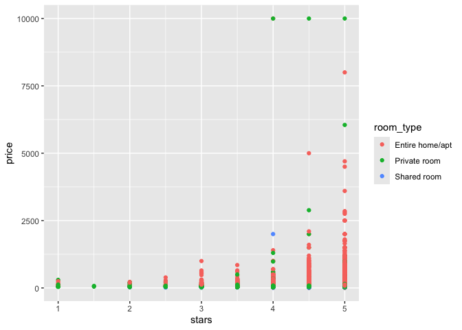
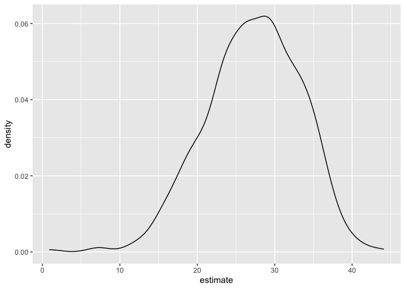

Bootstrapping
================

``` r
library(tidyverse)
```

    ## ── Attaching core tidyverse packages ──────────────────────── tidyverse 2.0.0 ──
    ## ✔ dplyr     1.1.4     ✔ readr     2.1.5
    ## ✔ forcats   1.0.0     ✔ stringr   1.5.1
    ## ✔ ggplot2   3.5.2     ✔ tibble    3.3.0
    ## ✔ lubridate 1.9.4     ✔ tidyr     1.3.1
    ## ✔ purrr     1.1.0     
    ## ── Conflicts ────────────────────────────────────────── tidyverse_conflicts() ──
    ## ✖ dplyr::filter() masks stats::filter()
    ## ✖ dplyr::lag()    masks stats::lag()
    ## ℹ Use the conflicted package (<http://conflicted.r-lib.org/>) to force all conflicts to become errors

``` r
library(p8105.datasets)

set.seed(1)
```

## Bootstrapping in SLR

Simulate 2 datasets, one works with linear regression, one doesn’t

``` r
n_samp = 250

sim_df_const = 
  tibble(
    x = rnorm(n_samp, 1, 1), # mean = 1, sd = 1
    error = rnorm(n_samp, 0, 1), # mean = 0, sd = 1
    y = 2 + 3 * x + error
  )

sim_df_nonconst = sim_df_const |> 
  mutate(
  error = error * .75 * x,
  y = 2 + 3 * x + error
)
```

Look at these data

``` r
sim_df = 
  bind_rows(const = sim_df_const, nonconst = sim_df_nonconst, .id = "data_source") 

sim_df |> 
  ggplot(aes(x = x, y = y)) + 
  geom_point(alpha = .5) +
  stat_smooth(method = "lm") +
  facet_grid(~data_source) 
```

    ## `geom_smooth()` using formula = 'y ~ x'

<!-- -->

What does `lm` do for these?

``` r
lm(y ~ x, data = sim_df_const) |> 
  broom::tidy() |> 
  knitr::kable(digits = 3)
```

| term        | estimate | std.error | statistic | p.value |
|:------------|---------:|----------:|----------:|--------:|
| (Intercept) |    1.977 |     0.098 |    20.157 |       0 |
| x           |    3.045 |     0.070 |    43.537 |       0 |

``` r
lm(y ~ x, data = sim_df_nonconst) |> 
  broom::tidy() |> 
  knitr::kable(digits = 3)
```

| term        | estimate | std.error | statistic | p.value |
|:------------|---------:|----------:|----------:|--------:|
| (Intercept) |    1.934 |     0.105 |    18.456 |       0 |
| x           |    3.112 |     0.075 |    41.661 |       0 |

Despite the very different error structures, standard errors for
coefficient estimates are similar in both cases!

## Drawing one bootstrap sample

Write a function to draw bootstrap sample.

``` r
boot_sample = function(df) {
  sample_frac(df, replace = TRUE)
}
```

Compute a linear model to each bootstrap sample.

``` r
boot_sample(sim_df_nonconst) |> 
  ggplot(aes(x = x, y = y)) + 
  geom_point(alpha = .5) +
  stat_smooth(method = "lm")
```

    ## `geom_smooth()` using formula = 'y ~ x'

<!-- -->

## Drawing many bootstrap samples

Draw repeated samples with replacement

``` r
boot_straps = 
  tibble(strap_number = 1:5000) |> 
  mutate(
    strap_sample = map(strap_number, \(i) boot_sample(df = sim_df_nonconst))
  )

boot_straps
```

    ## # A tibble: 5,000 × 2
    ##    strap_number strap_sample      
    ##           <int> <list>            
    ##  1            1 <tibble [250 × 3]>
    ##  2            2 <tibble [250 × 3]>
    ##  3            3 <tibble [250 × 3]>
    ##  4            4 <tibble [250 × 3]>
    ##  5            5 <tibble [250 × 3]>
    ##  6            6 <tibble [250 × 3]>
    ##  7            7 <tibble [250 × 3]>
    ##  8            8 <tibble [250 × 3]>
    ##  9            9 <tibble [250 × 3]>
    ## 10           10 <tibble [250 × 3]>
    ## # ℹ 4,990 more rows

Quick checks to make sure this has worked as intended. First look at a
couple of bootstrap samples.

``` r
boot_straps |> 
  slice(1:3) |> 
  mutate(strap_sample = map(strap_sample, \(s) arrange(s, x))) |> 
  pull(strap_sample)
```

    ## [[1]]
    ## # A tibble: 250 × 3
    ##         x   error       y
    ##     <dbl>   <dbl>   <dbl>
    ##  1 -1.89   1.62   -2.04  
    ##  2 -1.89   1.62   -2.04  
    ##  3 -1.21  -0.781  -2.43  
    ##  4 -1.21  -0.781  -2.43  
    ##  5 -1.00   0.832  -0.169 
    ##  6 -0.989 -1.97   -2.93  
    ##  7 -0.914 -0.908  -1.65  
    ##  8 -0.606 -0.106   0.0774
    ##  9 -0.536  0.0227  0.413 
    ## 10 -0.524 -0.536  -0.106 
    ## # ℹ 240 more rows
    ## 
    ## [[2]]
    ## # A tibble: 250 × 3
    ##         x  error       y
    ##     <dbl>  <dbl>   <dbl>
    ##  1 -1.29   1.40  -0.454 
    ##  2 -0.989 -1.97  -2.93  
    ##  3 -0.914 -0.908 -1.65  
    ##  4 -0.914 -0.908 -1.65  
    ##  5 -0.805  0.292 -0.123 
    ##  6 -0.805  0.292 -0.123 
    ##  7 -0.665 -0.544 -0.539 
    ##  8 -0.641 -0.416 -0.338 
    ##  9 -0.606 -0.106  0.0774
    ## 10 -0.606 -0.106  0.0774
    ## # ℹ 240 more rows
    ## 
    ## [[3]]
    ## # A tibble: 250 × 3
    ##         x  error      y
    ##     <dbl>  <dbl>  <dbl>
    ##  1 -1.89   1.62  -2.04 
    ##  2 -1.89   1.62  -2.04 
    ##  3 -1.29   1.40  -0.454
    ##  4 -1.29   1.40  -0.454
    ##  5 -1.00   0.832 -0.169
    ##  6 -0.914 -0.908 -1.65 
    ##  7 -0.805  0.292 -0.123
    ##  8 -0.665 -0.544 -0.539
    ##  9 -0.665 -0.544 -0.539
    ## 10 -0.665 -0.544 -0.539
    ## # ℹ 240 more rows

Seems okay – some values are repeated, some don’t appear in both
datasets.

Next, use ggplot to show some of these datasets, and to include a linear
fit for each.

``` r
boot_straps |> 
  slice(1:3) |> 
  unnest(strap_sample) |> 
  ggplot(aes(x = x, y = y)) + 
  geom_point(alpha = .5) +
  stat_smooth(method = "lm", se = FALSE) +
  facet_grid(~strap_number) 
```

    ## `geom_smooth()` using formula = 'y ~ x'

<!-- --> This
shows some of the differences across bootstrap samples, and shows that
the fitted regression lines aren’t the same for every bootstrap sample.

## Analyzing bootstrap samples

Finally, run analysis

``` r
bootstrap_results = 
  boot_straps |> 
  mutate(
    models = map(strap_sample, \(df) lm(y ~ x, data = df) ),
    results = map(models, broom::tidy)) |> 
  select(-strap_sample, -models) |> 
  unnest(results) 
bootstrap_results
```

    ## # A tibble: 10,000 × 6
    ##    strap_number term        estimate std.error statistic   p.value
    ##           <int> <chr>          <dbl>     <dbl>     <dbl>     <dbl>
    ##  1            1 (Intercept)     1.90    0.0982      19.3 2.45e- 51
    ##  2            1 x               3.14    0.0688      45.6 1.18e-122
    ##  3            2 (Intercept)     1.89    0.118       16.0 4.78e- 40
    ##  4            2 x               3.12    0.0843      37.0 5.32e-103
    ##  5            3 (Intercept)     2.06    0.0976      21.1 3.71e- 57
    ##  6            3 x               2.97    0.0690      43.1 2.89e-117
    ##  7            4 (Intercept)     2.04    0.102       20.0 9.03e- 54
    ##  8            4 x               3.03    0.0699      43.3 1.43e-117
    ##  9            5 (Intercept)     1.90    0.113       16.8 1.01e- 42
    ## 10            5 x               3.18    0.0772      41.2 7.18e-113
    ## # ℹ 9,990 more rows

Look at results

``` r
bootstrap_results |> 
  group_by(term) |> 
  summarize(
    boot_mean = mean(estimate),
    boot_se = sd(estimate)) |> 
  knitr::kable(digits = 3)
```

| term        | boot_mean | boot_se |
|:------------|----------:|--------:|
| (Intercept) |     1.933 |   0.076 |
| x           |     3.112 |   0.103 |

Comparing these to the results of ordinary least squares, the standard
error for the intercept is much smaller (more confident to the
intercept) and the standard error for the slope is a bit larger. This is
reasonable, given the non-constant variance in the data given smaller
residuals around zero and larger residuals in the the tails of the x
distribution.

Use the estimates across bootstrap samples to construct a confidence
interval.

``` r
bootstrap_results |> 
  group_by(term) |> 
  summarize(
    ci_lower = quantile(estimate, 0.025), 
    ci_upper = quantile(estimate, 0.975))
```

    ## # A tibble: 2 × 3
    ##   term        ci_lower ci_upper
    ##   <chr>          <dbl>    <dbl>
    ## 1 (Intercept)     1.78     2.09
    ## 2 x               2.91     3.32

For a simple linear regression, we can show the fitted lines for each
bootstrap sample to build intuition for these results.

``` r
boot_straps |> 
  unnest(strap_sample) |> 
  ggplot(aes(x = x, y = y)) + 
  geom_line(aes(group = strap_number), stat = "smooth", method = "lm", se = FALSE, alpha = .1, color = "blue") +
  geom_point(data = sim_df_nonconst, alpha = .5)
```

    ## `geom_smooth()` using formula = 'y ~ x'

<!-- --> In
comparison to the standard error bands in our previous plot (which are
based on OLS), the distribution of regression lines is narrower near x =
0 and wider at the ends of the x istribution.

## `bootstrap`

`bootstrap` function; easy to draw bootstrap samples, and stores them in
a mostly-helpful way – as a `resample` object that can be converted to
and treated like a data frame.

``` r
boot_straps = 
  sim_df_nonconst |> 
  modelr::bootstrap(n = 1000)

boot_straps |> pull(strap) |> nth(1)
```

    ## <resample [250 x 3]> 186, 113, 206, 28, 86, 121, 208, 212, 30, 12, ...

``` r
boot_straps |> pull(strap) |> nth(1) |> as_tibble()
```

    ## # A tibble: 250 × 3
    ##         x  error      y
    ##     <dbl>  <dbl>  <dbl>
    ##  1  0.841 -0.125  4.40 
    ##  2  2.43  -1.16   8.14 
    ##  3  3.50   0.148 12.6  
    ##  4 -0.471 -0.262  0.326
    ##  5  1.33   0.733  6.73 
    ##  6  0.494 -0.144  3.34 
    ##  7  1.54  -2.43   4.20 
    ##  8  1.42   2.31   8.57 
    ##  9  1.42   0.978  7.23 
    ## 10  1.39  -0.406  5.76 
    ## # ℹ 240 more rows

Repeat our analysis pipeline using the bootstrap function instead of our
own process for drawing samples with replacement.

``` r
sim_df_nonconst |> 
  modelr::bootstrap(n = 1000) |> 
  mutate(
    models = map(strap, \(df) lm(y ~ x, data = df) ),
    results = map(models, broom::tidy)) |> 
  select(-strap, -models) |> 
  unnest(results) |> 
  group_by(term) |> 
  summarize(boot_se = sd(estimate))
```

    ## # A tibble: 2 × 2
    ##   term        boot_se
    ##   <chr>         <dbl>
    ## 1 (Intercept)  0.0752
    ## 2 x            0.104

To `bootstrap` the dataset with constant error variance, we only have to
change the input dataframe!

``` r
sim_df_const |> 
  modelr::bootstrap(n = 1000) |> 
  mutate(
    models = map(strap, \(df) lm(y ~ x, data = df)),
    results = map(models, broom::tidy)) |> 
  select(-strap, -models) |> 
  unnest(results) |> 
  group_by(term) |> 
  summarize(boot_se = sd(estimate))
```

    ## # A tibble: 2 × 2
    ##   term        boot_se
    ##   <chr>         <dbl>
    ## 1 (Intercept)  0.0968
    ## 2 x            0.0717

## Airbnb Example

Loads and tidies the data.

``` r
data("nyc_airbnb")

nyc_airbnb = 
  nyc_airbnb |> 
  mutate(stars = review_scores_location / 2) |> 
  rename(
    borough = neighbourhood_group,
    neighborhood = neighbourhood) |> 
  filter(borough != "Staten Island") |> 
  drop_na(price, stars) |> 
  select(price, stars, borough, neighborhood, room_type)
```

Quick plot showing these data, with particular emphasis on the features
`price` as an outcome with `stars` and `room_type` as covariates.

``` r
nyc_airbnb |> 
  ggplot(aes(x = stars, y = price, color = room_type)) + 
  geom_point() 
```

<!-- --> In
this plot, we noticed that some large outliers in price might affect
estimates and inference for the association between star rating and
price. Because estimates are likely to be sensitive to those outliers
and “usual” rules for inference may not apply.

Uses the `bootstrap` to examine the distribution of regression
coefficients under repeated sampling.

``` r
nyc_airbnb |> 
  filter(borough == "Manhattan") |> 
  modelr::bootstrap(n = 1000) |> 
  mutate(
    models = map(strap, \(df) lm(price ~ stars + room_type, data = df)),
    results = map(models, broom::tidy)) |> 
  select(results) |> 
  unnest(results) |> 
  filter(term == "stars") |> 
  ggplot(aes(x = estimate)) + geom_density()
```

<!-- -->
