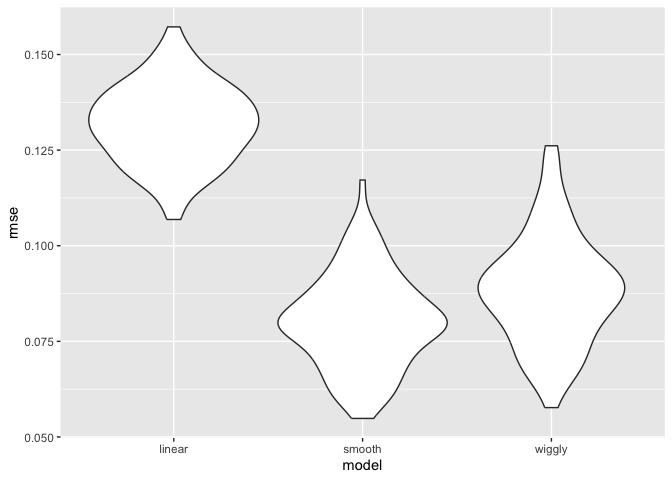
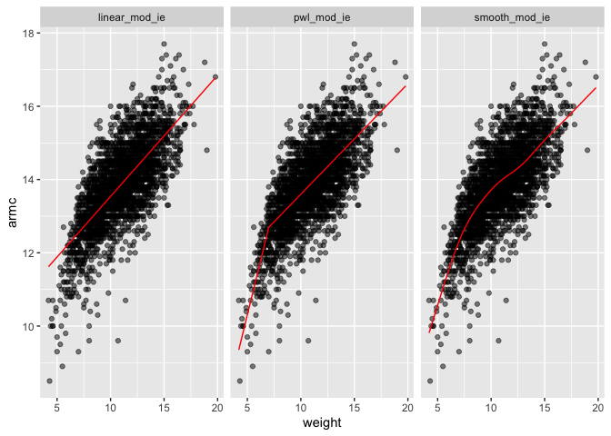
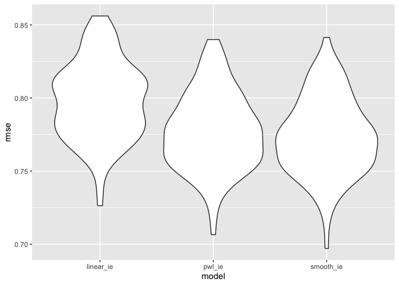

Cross Validation
================

``` r
library(tidyverse)
```

    ## ── Attaching core tidyverse packages ──────────────────────── tidyverse 2.0.0 ──
    ## ✔ dplyr     1.1.4     ✔ readr     2.1.5
    ## ✔ forcats   1.0.0     ✔ stringr   1.5.1
    ## ✔ ggplot2   3.5.2     ✔ tibble    3.3.0
    ## ✔ lubridate 1.9.4     ✔ tidyr     1.3.1
    ## ✔ purrr     1.1.0     
    ## ── Conflicts ────────────────────────────────────────── tidyverse_conflicts() ──
    ## ✖ dplyr::filter() masks stats::filter()
    ## ✖ dplyr::lag()    masks stats::lag()
    ## ℹ Use the conflicted package (<http://conflicted.r-lib.org/>) to force all conflicts to become errors

``` r
library(modelr)
library(mgcv)
```

    ## Loading required package: nlme
    ## 
    ## Attaching package: 'nlme'
    ## 
    ## The following object is masked from 'package:dplyr':
    ## 
    ##     collapse
    ## 
    ## This is mgcv 1.9-3. For overview type 'help("mgcv-package")'.

``` r
library(p8105.datasets)

set.seed(1)
```

## CV “by hand”

``` r
data("lidar")

lidar_df = 
  lidar |> 
  as_tibble() |>
  mutate(id = row_number())

lidar_df |> 
  ggplot(aes(x = range, y = logratio)) + 
  geom_point()
```

<!-- -->

Split this data into training and test sets (using anti_join!!), and
replot showing the split. Our goal will be to use the training data (in
black) to build candidate models, and then see how those models predict
in the testing data (in red).

``` r
train_df = sample_frac(lidar_df, size = .8)
test_df = anti_join(lidar_df, train_df, by = "id")

ggplot(train_df, aes(x = range, y = logratio)) + 
  geom_point() + 
  geom_point(data = test_df, color = "red")
```

<!-- -->

Fit a few models to ‘train_df’.

``` r
linear_mod = lm(logratio ~ range, data = train_df)
smooth_mod = mgcv::gam(logratio ~ s(range), data = train_df)
wiggly_mod = mgcv::gam(logratio ~ s(range, k = 30), sp = 10e-6, data = train_df)
```

Applied the smooth model, fits better than the linear.

``` r
train_df |> 
  add_predictions(smooth_mod) |> 
  ggplot(aes(x = range, y = logratio)) + 
  geom_point() + 
  geom_line(aes(y = pred), color = "red")
```

<!-- -->

Applied the wiggly model that account for the noise (bounce up and
down), making slightly worse predictions – Overfitting.

``` r
train_df |> 
  add_predictions(wiggly_mod) |> 
  ggplot(aes(x = range, y = logratio)) + 
  geom_point() + 
  geom_line(aes(y = pred), color = "red")
```

<!-- -->

Put 3 together for comparison.

``` r
train_df |> 
  gather_predictions(linear_mod, smooth_mod, wiggly_mod) |> 
  mutate(model = fct_inorder(model)) |> 
  ggplot(aes(x = range, y = logratio)) + 
  geom_point() + 
  geom_line(aes(y = pred), color = "red") + 
  facet_wrap(~model)
```

<!-- -->

Try compute out RMSEs.

``` r
rmse(linear_mod, test_df)
```

    ## [1] 0.127317

``` r
rmse(smooth_mod, test_df)
```

    ## [1] 0.08302008

``` r
rmse(wiggly_mod, test_df)
```

    ## [1] 0.08848557

## Iterating Cross Validation (CV) using `modelr`

`crossv_mc` preforms the training / testing split multiple times, a
stores the datasets using list columns.

``` r
cv_df = 
  crossv_mc(lidar_df, 100) 
```

`crossv_mc` saves the data once and stores the indexes for each training
/ testing split using a `resample` object, and can often be treated
exactly like a dataframe. However, it’s not compatible with `gam`, so we
have to convert each training and testing dataset (and lose that nice
memory-saving stuff in the process) using the code below. \*It’s worth
noting, though, that if all the models you want to fit use `lm`, you can
skip this.

``` r
cv_df |> pull(train) |> nth(1) |> as_tibble()
```

    ## # A tibble: 176 × 3
    ##    range logratio    id
    ##    <dbl>    <dbl> <int>
    ##  1   390  -0.0504     1
    ##  2   394  -0.0510     4
    ##  3   396  -0.0599     5
    ##  4   399  -0.0596     7
    ##  5   400  -0.0399     8
    ##  6   402  -0.0294     9
    ##  7   403  -0.0395    10
    ##  8   405  -0.0476    11
    ##  9   406  -0.0604    12
    ## 10   408  -0.0312    13
    ## # ℹ 166 more rows

``` r
cv_df |> pull(test) |> nth(1) |> as_tibble()
```

    ## # A tibble: 45 × 3
    ##    range logratio    id
    ##    <dbl>    <dbl> <int>
    ##  1   391  -0.0601     2
    ##  2   393  -0.0419     3
    ##  3   397  -0.0284     6
    ##  4   412  -0.0500    16
    ##  5   421  -0.0316    22
    ##  6   424  -0.0884    24
    ##  7   426  -0.0702    25
    ##  8   427  -0.0288    26
    ##  9   436  -0.0573    32
    ## 10   445  -0.0647    38
    ## # ℹ 35 more rows

``` r
cv_df =
  cv_df |> 
  mutate(
    train = map(train, as_tibble),
    test = map(test, as_tibble))
```

Fits the models over and over:

``` r
cv_df = 
  cv_df |> 
  mutate(
    linear_mod  = map(train, \(df) lm(logratio ~ range, data = df)),
    smooth_mod  = map(train, \(df) gam(logratio ~ s(range), data = df)),
    wiggly_mod  = map(train, \(df) gam(logratio ~ s(range, k = 30), sp = 10e-8, data = df))) |> 
  mutate(
    rmse_linear = map2_dbl(linear_mod, test, rmse),
    rmse_smooth = map2_dbl(smooth_mod, test, rmse),
    rmse_wiggly = map2_dbl(wiggly_mod, test, rmse))
```

Try to look at this better in the long format

``` r
cv_df |> 
  select(starts_with("rmse")) |> 
  pivot_longer(
    everything(),
    names_to = "model", 
    values_to = "rmse",
    names_prefix = "rmse_") |> 
  mutate(model = fct_inorder(model)) |> 
  ggplot(aes(x = model, y = rmse)) + geom_violin()
```

<!-- -->

## Example: Child Growth

``` r
child_growth = read_csv("./data/nepalese_children.csv")
```

    ## Rows: 2705 Columns: 5
    ## ── Column specification ────────────────────────────────────────────────────────
    ## Delimiter: ","
    ## dbl (5): age, sex, weight, height, armc
    ## 
    ## ℹ Use `spec()` to retrieve the full column specification for this data.
    ## ℹ Specify the column types or set `show_col_types = FALSE` to quiet this message.

``` r
child_growth |> 
  ggplot(aes(x = weight, y = armc)) + 
  geom_point(alpha = .5)
```

<!-- -->
We’ll try three models: a linear fit; a piecewise linear fit; and a
smooth fit using `gam`. For the piecewise linear fit, we need to add a
“change point term” to our dataframe.

``` r
child_growth =
  child_growth |> 
  mutate(weight_cp7 = (weight > 7) * (weight - 7))
```

Fits each of the candidate models to the full dataset

``` r
linear_mod_ie = lm(armc ~ weight, data = child_growth)
pwl_mod_ie    = lm(armc ~ weight + weight_cp7, data = child_growth)
smooth_mod_ie = gam(armc ~ s(weight), data = child_growth)
```

Plot the three models to get intuition for goodness of fit.

``` r
child_growth |> 
  gather_predictions(linear_mod_ie, pwl_mod_ie, smooth_mod_ie) |> 
  mutate(model = fct_inorder(model)) |> 
  ggplot(aes(x = weight, y = armc)) + 
  geom_point(alpha = .5) +
  geom_line(aes(y = pred), color = "red") + 
  facet_grid(~model)
```

<!-- -->
It’s not clear which is best – the linear model is maybe too simple, but
the piecewise and non-linear models are pretty similar!

Better check prediction errors using the same process as before – again,
since I want to fit a `gam` model, I have to convert the `resample`
objects produced by `crossv_mc` to dataframes, but wouldn’t have to do
this if I only wanted to compare the linear and piecewise models.

``` r
cv_df_ie =
  crossv_mc(child_growth, 100) |> 
  mutate(
    train = map(train, as_tibble),
    test = map(test, as_tibble))
```

Use `mutate` + `map` & `map2`to fit models to training data and obtain
corresponding RMSEs for the testing data.

``` r
cv_df_ie = 
  cv_df_ie |> 
  mutate(
    linear_mod_ie  = map(train, \(df) lm(armc ~ weight, data = df)),
    pwl_mod_ie     = map(train, \(df) lm(armc ~ weight + weight_cp7, data = df)),
    smooth_mod_ie  = map(train, \(df) gam(armc ~ s(weight), data = as_tibble(df)))) |> 
  mutate(
    rmse_linear_ie = map2_dbl(linear_mod_ie, test, \(mod, df) rmse(model = mod, data = df)),
    rmse_pwl_ie   = map2_dbl(pwl_mod_ie, test, \(mod, df) rmse(model = mod, data = df)),
    rmse_smooth_ie = map2_dbl(smooth_mod_ie, test, \(mod, df) rmse(model = mod, data = df)))
```

Plot the prediction error distribution for each candidate model.

``` r
cv_df_ie |> 
  select(starts_with("rmse")) |> 
  pivot_longer(
    everything(),
    names_to = "model", 
    values_to = "rmse",
    names_prefix = "rmse_") |> 
  mutate(model = fct_inorder(model)) |> 
  ggplot(aes(x = model, y = rmse)) + geom_violin()
```

<!-- -->
